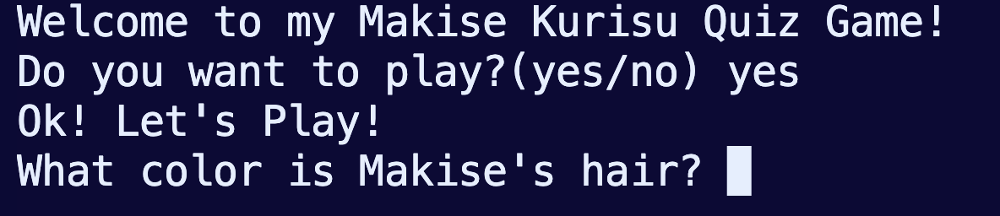

# Makise Kurisu Quiz Game

A Python quiz game based on the character Makise Kurisu from the anime and visual novel series "Steins;Gate." Test your knowledge about Makise Kurisu and see how well you know her!

## Features

- Five open-ended questions about Makise Kurisu.
- Interactive gameplay with a score counter.
- Instant feedback on correct and incorrect answers.
- End-of-game summary with the final score.

## Requirements

- Python 3.9.6

## Usage

1. Clone this repository to your local machine:
   git clone https://github.com/daisiecommits/quiz-game.git

2. Navigate to the project directory:
   cd makise-kurisu-quiz-game

3. Run the game:
   python quiz_game.py

4. Answer the multiple-choice questions by entering the corresponding option number.

5. After answering all the questions, you will receive a summary of your performance with the final score.

## Screenshot

